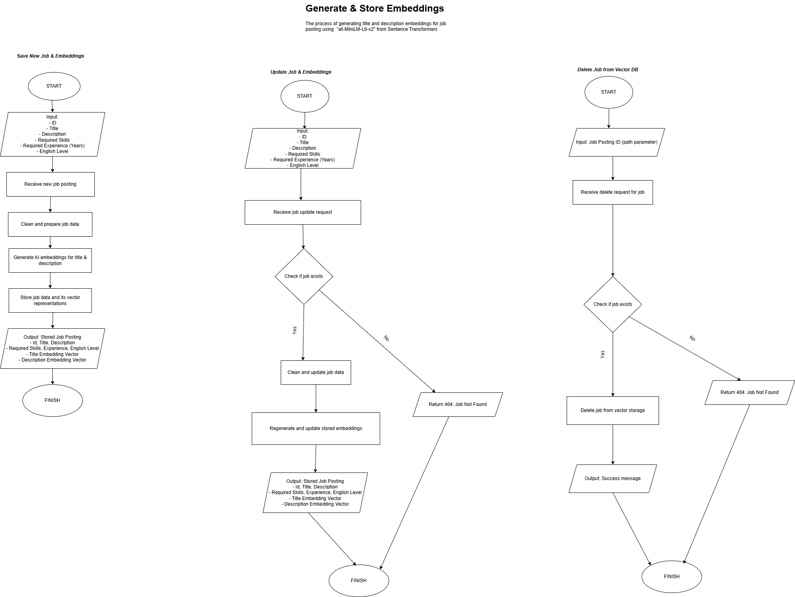
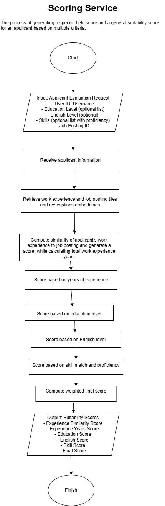

# CodePioneers Career Portal – Job Evaluation Microservice (FastAPI)

This FastAPI microservice calculates candidate suitability scores for job postings by evaluating work experience, years of experience, education level, skills, and English proficiency. It then combines these weighted scores into an overall score that reflects the applicant’s suitability for the job posting they have applied to.

---

## Table of Contents

- [How It Works](#how-it-works)
- [Flowcharts](#flowcharts)
- [Project Structure](#project-structure)
- [Tech Stack](#tech-stack)
- [Setup and Installation](#setup-and-installation)
- [API Documentation](#api-documentation)
- [Related Repositories](#related-repositories)
- [Author](#author)

---

## How It Works

The service computes several sub-scores and combines them into a final suitability score:

- **Work Experience Similarity**: compares embeddings of user work titles/descriptions with job posting vectors (via the Sentence Transformer Model `all-MiniLM-L6-v2`).
- **Years of Experience**: uses a scaled sigmoid function against required experience.
- **Skill Score**: averages proficiency of matched skills weighted by coverage.
- **Education Score**: selects highest level from a predefined scale.
- **English Score**: maps proficiency to a numeric scale.
- **Final Score**: weighted sum of all sub-scores (`40% work experience similarity, 20% experience years needed, 15% education, 15% English, 10% skills`).

---

## Flowcharts

#### Generating & Saving Embeddings for Work Experience


#### Generating & Saving Embeddings for Job Posting



#### Scoring Service Logic



---

## Project Structure

```plaintext
job-eval-backend-fastapi/
├── api_routes/         # FastAPI route definitions
├── assets/             # Flowcharts and architecture diagrams
├── clients/            # External service clients (e.g., ChromaDB)
├── constants/          # Scoring constants and weight configs
├── core/               # Middleware and security logic
├── data_collections/   # ChromaDB vector collections
├── db/                 # Local ChromaDB instance (e.g., SQLite file)
├── schemas/            # Pydantic models for request/response
├── services/           # Business and scoring logic
├── utils/              # Utility functions like preprocessing
├── .env                # Environment variables
├── main.py             # FastAPI app entry point
├── requirements.txt    # Project dependencies
└── README.md           # Project documentation
```

---

## Tech Stack

- FastAPI – High-performance Python web framework

- Python 3.10+ – Core language

- Pydantic – Data validation and settings management

- ChromaDB – Vector store for embeddings

- Sentence Transformers – Semantic embeddings with all-MiniLM-L6-v2

- Uvicorn – ASGI server for running FastAPI

- python-dotenv – Load environment variables from .env

---

## Setup & Installation

1. **Clone the repository**

```bash
git clone https://github.com/rigelHadushiDev/job-eval-backend-fastapi.git
cd job-eval-backend-fastapi
```

2. **Create & activate a virtual environment**

```bash
python3 -m venv .venv
```

**macOS/Linux**

```bash
source .venv/bin/activate
```

**Windows (PowerShell)**

```bash
.venv\Scripts\Activate.ps1
```

3. **Install dependencies**

```bash
pip install --upgrade pip
pip install -r requirements.txt
```

4. **Configure environment variables**
   Copy the example and edit with your values

```bash
cp .env.example .env
```

Then open `.env` and set:

```bash
CHROMA_DB_PATH=./db/chroma.sqlite3
ANY_API_KEYS_OR_SECRETS
```

5. **(Optional) Initialize ChromaDB**
   If you need an empty DB file:

```bash
mkdir -p db
touch db/chroma.sqlite3
```

6. **Run the service locally**

```bash
uvicorn main:app --reload
```

---

### API Documentation

Once running, explore all endpoints via Swagger UI at:

```bash
http://localhost:8000/docs#/
```

### Related Repositories

- **Main Application Backend**: [job-eval-backend-spring](https://github.com/rigelHadushiDev/job-eval-backend-spring)

- **React Frontend (User Interface)**: [job-eval-frontend-react](https://github.com/rigelHadushiDev/job-eval-frontend-react) (in progress)

---

### Author

Developed by [@rigelHadushiDev](https://github.com/rigelHadushiDev)
